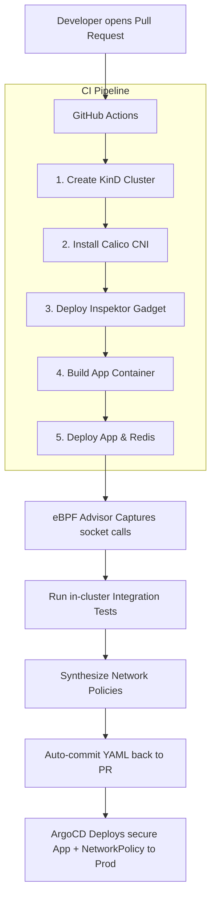

# Dynamic Zero-Trust Policy Synthesis via eBPF Profiling

A modern, automated DevSecOps pipeline that dynamically generates least-privilege Kubernetes NetworkPolicies by profiling container socket connections at the Linux kernel level using eBPF.

---

## 🚨 The Challenge of Zero-Trust Network Policies

In a secure Kubernetes cluster, pods should operate under a **Zero-Trust** network architecture. By default, Kubernetes allows all pods to communicate with each other. Securing this requires writing manual `NetworkPolicies`. 

However, manual policy configuration suffers from:
1. **High Complexity**: Developers must map every DNS request, database port, external API endpoint, and internal service dependency.
2. **Broken Applications**: To avoid breaking changes, developers often resort to permissive wildcard policies (e.g., allowing all ingress/egress), defeating the purpose of network security.
3. **Static Limitations**: Static Application Security Testing (SAST) tools cannot predict dynamic runtime dependencies.

---

## 💡 The eBPF Solution

This project solves the configuration bottleneck by **shifting security left** and automating policy design through runtime observation.



Instead of developers writing policies, the CI pipeline:
1. Deploys the code to a temporary, isolated Kubernetes namespace.
2. Starts a kernel-level **eBPF tracer** (Inspektor Gadget).
3. Runs the application test suite to trigger database and API traffic.
4. Synthesizes a strict, custom-tailored `NetworkPolicy` from the traced socket connections.
5. Commits the YAML policy directly back to the Git branch.

---

## 📂 Project Directory Structure

```text
.
├── .github/
│   └── workflows/
│       └── policy-synthesis.yml   # CI Pipeline orchestrator (KinD + eBPF setup)
├── app/
│   ├── tests/
│   │   └── integration.test.js    # Integration test suite
│   ├── index.js                   # Node.js target app (database + external calls)
│   ├── package.json               # App dependencies (Express, Redis client)
│   └── Dockerfile                 # Multi-stage Docker packaging configuration
├── kubernetes/
│   ├── app.yaml                   # Target application deployment & service
│   └── redis.yaml                  # Database deployment & service
├── policies/
│   └── synthesized-policies.yaml  # Auto-generated least-privilege NetworkPolicies
└── scripts/
    └── synthesize.sh              # Local/CI automation orchestration script
```

---

## 🛠️ Technology Stack

* **Kubernetes Networking (CNI)**: Calico (supports NetworkPolicy enforcement)
* **eBPF Engine**: Inspektor Gadget (Core advise/network-policy sensor)
* **CI/CD Platform**: GitHub Actions
* **Local Cluster Platform**: Minikube / KinD (Kubernetes in Docker)
* **Database & App**: Redis (database), Node.js (Express framework)

---

## 🏁 Quickstart: Run Locally

Follow these steps to execute the eBPF profiling pipeline locally on your system:

### 1. Prerequisite: Local Cluster Setup
Start Minikube with Calico CNI enabled:
```bash
minikube start --driver=docker --cni=calico
```

### 2. Install Inspektor Gadget CLI
Download the latest client binary and deploy the cluster-wide daemonsets:
```bash
# Fetch latest version and download binary
IG_VERSION=$(curl -s https://api.github.com/repos/inspektor-gadget/inspektor-gadget/releases/latest | jq -r .tag_name)
curl -sL "https://github.com/inspektor-gadget/inspektor-gadget/releases/download/${IG_VERSION}/kubectl-gadget-linux-amd64-${IG_VERSION}.tar.gz" | tar -C /tmp -xz
sudo mv /tmp/kubectl-gadget /usr/local/bin/kubectl-gadget

# Deploy agent inside cluster
kubectl gadget deploy
```

### 3. Build & Deploy the Target Application
Point your Docker daemon to Minikube, build the image, and apply the deployment manifests:
```bash
# Configure terminal environment
eval $(minikube -p minikube docker-env)

# Build image
docker build -t ebpf-target-app:latest ./app

# Deploy App & Redis
kubectl apply -f kubernetes/redis.yaml
kubectl apply -f kubernetes/app.yaml
```

### 4. Synthesize Network Policies
Execute the automation script. It starts the background tracer, restarts the app to catch boot-time DB handshakes, triggers in-cluster HTTP test traffic, compiles the results, and writes the output:
```bash
# Make script executable
chmod +x scripts/synthesize.sh

# Run synthesis
./scripts/synthesize.sh
```

Review your generated zero-trust security configuration:
```bash
cat policies/synthesized-policies.yaml
```
