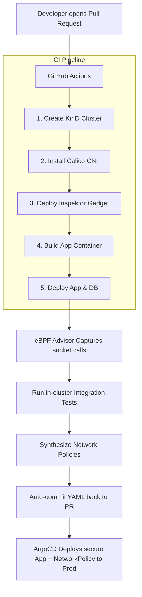

# 🛡️ eBPF Zero-Trust Policies

[](https://opensource.org/licenses/MIT)

A modern, automated DevSecOps pipeline that dynamically generates **least-privilege Kubernetes NetworkPolicies** by profiling container socket connections at the Linux kernel level using **eBPF**.

---

## 🤯 The Challenge & The eBPF Solution

Writing Kubernetes `NetworkPolicies` manually is tedious and error-prone. To avoid breaking applications in production, developers often resort to overly permissive "allow-all" rules. 

This project **shifts security left** by observing what your application *actually does* during testing, and automatically generating a strict Zero-Trust policy.

### Before (Manual & Insecure)
Developers guess what network access is needed, or give up and allow everything:
```yaml
ingress: [] # Allows ALL incoming traffic - DANGEROUS!
```

### After (Auto-Generated & Secure)
Our eBPF tracer observes the exact API and database calls your app makes, and synthesizes a strict, custom-tailored policy:
```yaml
ingress:
  - from:
    - podSelector:
        matchLabels:
          app: backend-api # Only allows traffic from the exact pods that need it
```

---

## 🚀 Quickstart: Run the Demo

Want to see the magic in action? You can run the entire pipeline locally to see how eBPF traces our example Node.js app.

**Prerequisites:** `docker`, `kubectl`, `minikube`

Just run our 1-click setup script:
```bash
chmod +x run-demo.sh
./run-demo.sh
```

*(This will start a Minikube cluster with Calico, install Inspektor Gadget, deploy the example app, trace the traffic, and generate your Zero-Trust policy in the `policies/` directory!)*

---

## 🧠 How It Works Under the Hood



---

## 📂 Project Structure

```text
.
├── .github/workflows/
│   └── policy-synthesis.yml   # CI Pipeline orchestrator
├── app/                       # Target Node.js application code
├── kubernetes/                # Deployment YAMLs for App & Redis DB
├── scripts/
│   └── synthesize.sh          # eBPF automation & traffic generation
├── policies/                  
│   └── synthesized-policies.yaml  # Where your generated policies will appear!
└── run-demo.sh                # Local 1-click execution script
```

---

## 📄 License
This project is licensed under the MIT License. See the `LICENSE` file for details.
